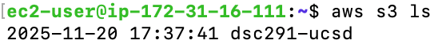

### Using S3 file storage

AWS EC2 instances come with **AWS CLI** preinstalled.

```bash
aws --version
```

At the bottom of the [login page](https://ets-apps.ucsd.edu/individual/DSC291_WI26_G00), we see the option for **Generate API Keys (for CLI/scripting)**. This will give you a list of secret access keys. These will help us connect to the **AWS S3**. Do:

```bash
aws configure
```

  - **AWS Access Key ID** → paste from the portal
  - **AWS Secret Access Key** → paste from the portal
  - **AWS Session Token** → paste from the portal
  - **Default region** → us-west-2 OR skip (press enter)
  - **Default output** → skip (press enter)

**OR** you can just copy everything from the window and paste it in the terminal directly. It will set up the above environment variables.

To test if it works, aws sts get-caller-identity, **If you see a valid json response → you are correctly authenticated.**

```bash
aws sts get-caller-identity
```

This command returns the AWS account ID and caller ARN of your current credentials.

Do aws s3 ls if that succeeds → **S3 CLI access is working.** This command lists all the buckets we have.

```bash
aws s3 ls
```

<p align="center">
  
</p>

- uploading a file: `aws s3 cp requirements.txt s3://dsc291-ucsd`
- download a file: `aws s3 cp s3://dsc291-ucsd/abc.pdf .`


A few other useful commands:
https://chatgpt.com/s/t_692a823738d8819187ba21785928a376

| **Task** | **Command** | **Notes** |
| --- | --- | --- |
| **List all buckets** | `aws s3 ls` | Shows all buckets you have access to |
| **List files in a bucket** | `aws s3 ls s3://bucket-name/` | Add path suffix if needed |
| **Upload a file** | `aws s3 cp file.txt s3://bucket-name/` | cp = copy |
| **Upload a directory (recursive)** | `aws s3 cp mydir/ s3://bucket-name/mydir/ --recursive` | Uploads everything |
| **Download a file** | `aws s3 cp s3://bucket-name/file.txt .` | Saves locally |
| **Download a directory** | `aws s3 cp s3://bucket-name/data/ ./data --recursive` | Downloads entire prefix/tree |
| **Sync local folder to S3** | `aws s3 sync local_folder/ s3://bucket-name/folder/` | Only uploads changed files |
| **Sync S3 to local machine** | `aws s3 sync s3://bucket-name/folder/ local_folder/` | Mirrors S3 to local |
| **Delete folder recursively** | `aws s3 rm s3://bucket-name/folder/ --recursive` | Permanently deletes all objects |
| **Move file** | `aws s3 mv s3://bucket-name/a.txt s3://bucket-name/b.txt` | mv = move |
| **Copy between buckets** | `aws s3 cp s3://bucket1/file s3://bucket2/file` | Cross-bucket copy |


### Troubleshooting

- <span style="color: red;">“fatal error: Unable to locate credentials”</span>
  - Re-run `aws configure` or re-paste the portal exports in the same terminal.
  - Open a new shell? Re-set the environment or use a profile.
- <span style="color: red;">“ExpiredToken”</span>
  - Temporary credentials expired. Re-generate keys from the portal and re-configure.
- <span style="color: red;">“AccessDenied”</span> or <span style="color: red;">“bucket not found”</span>
  - Check the bucket name/path and region. Ensure you’re using the latest credentials.
