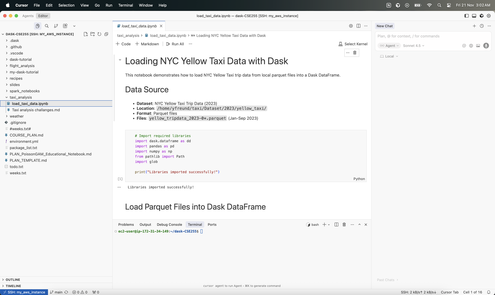

## **Directions to login, ssh tunnel inside Cursor**

### Download Cursor

**→** Download Cursor from here depending on your system configuration and OS. [Download Cursor](https://cursor.com/download)

### Launch an AWS instance

**→** Lanuch an AWS instance from **`DSC291-BaseImage`** AMI from here: [AWS Portal](https://ets-apps.ucsd.edu/individual/DSC291_WI26_A00)

Click on the above link → login using UCSD credentials → At the bottom **Click** here to access AWS → Go to AMIs inside Images and chose the desired AMI and launch an instance from that AMI.

### Entering the instance from CLI

Copy the **Public IPv4 address** from AWS launched instance and use the following CLI command. (Make sure you created a key pair from AWS, downloaded and moved it to ~/.ssh/). Example Public IPv4 address: 54.190.133.17.

```bash
ssh -i ~/.ssh/my_key_pair_dsc291.pem ec2-user@54.190.133.17
```

### Connecting from Cursor

**Step1**: Open SSH config: `nano ~/.ssh/config`

**Step2**: Add the following in this file:

```bash
Host my_aws_instance
		HostName 54.190.133.17
		User ec2-user
		IdentityFile ~/.ssh/my_key_pair_dsc291.pem
```

**Step3:** Inside Cursor do:
Cmd+Shift+P (Ctrl+Shift+P) → type ssh → you should see `my_aws_instance` . Cursor will try to connect to the instance.

**Step4:** open the cloned project [dask-CSE255](https://github.com/yoavfreund/dask-CSE255).

Now, we can use GenAI inside the project!!

<p align="center">
  
</p>


### Misc 

- SSH config creates a short alias (`my_aws_instance`) so you can connect without typing the full command.
- Private key must be locked down or SSH will refuse it: `chmod 400 ~/.ssh/my_key_pair_dsc291.pem`.
